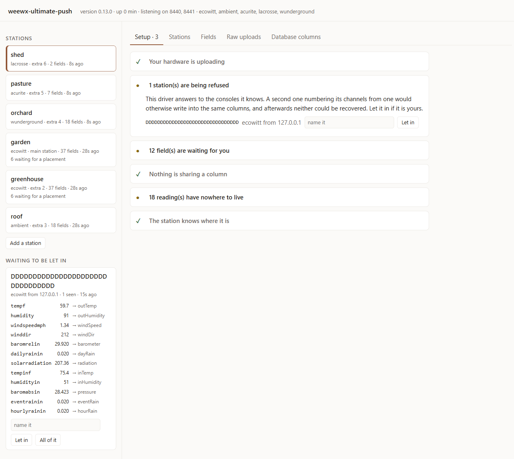
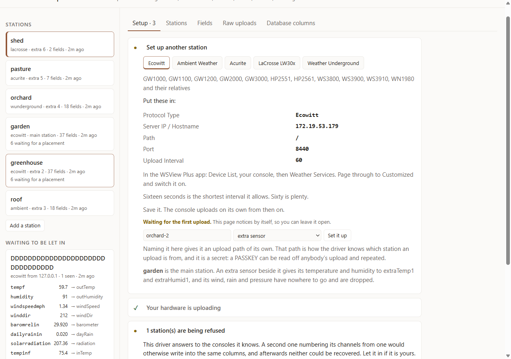
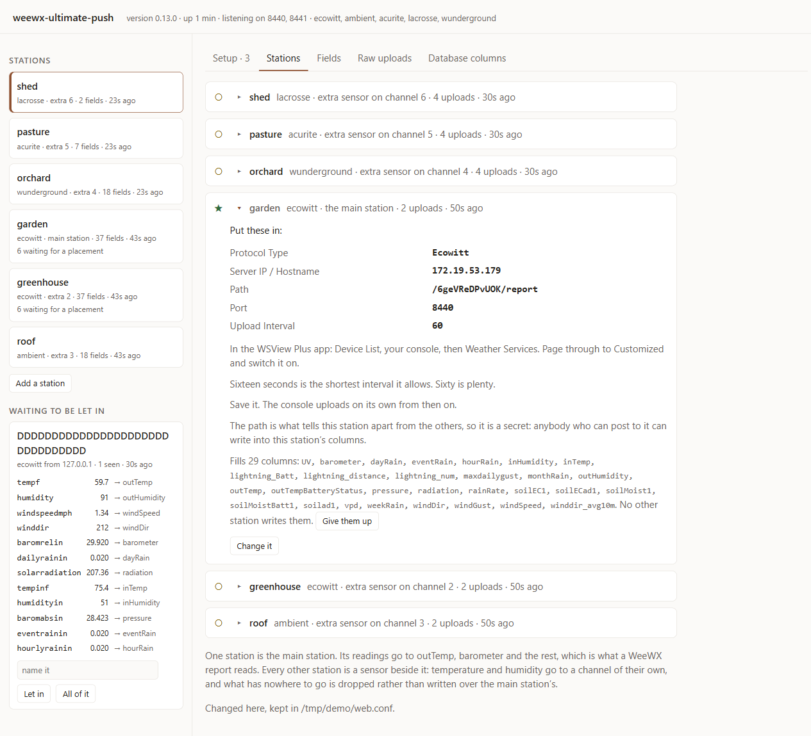
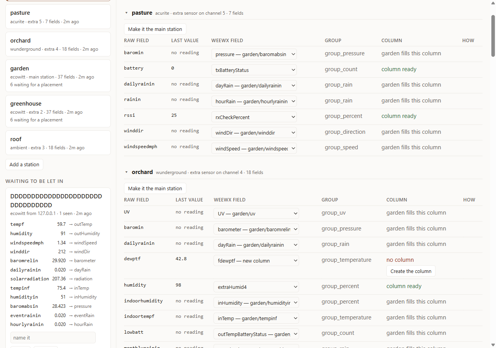
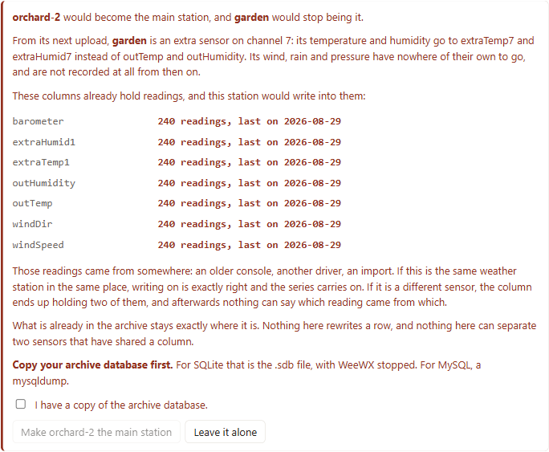
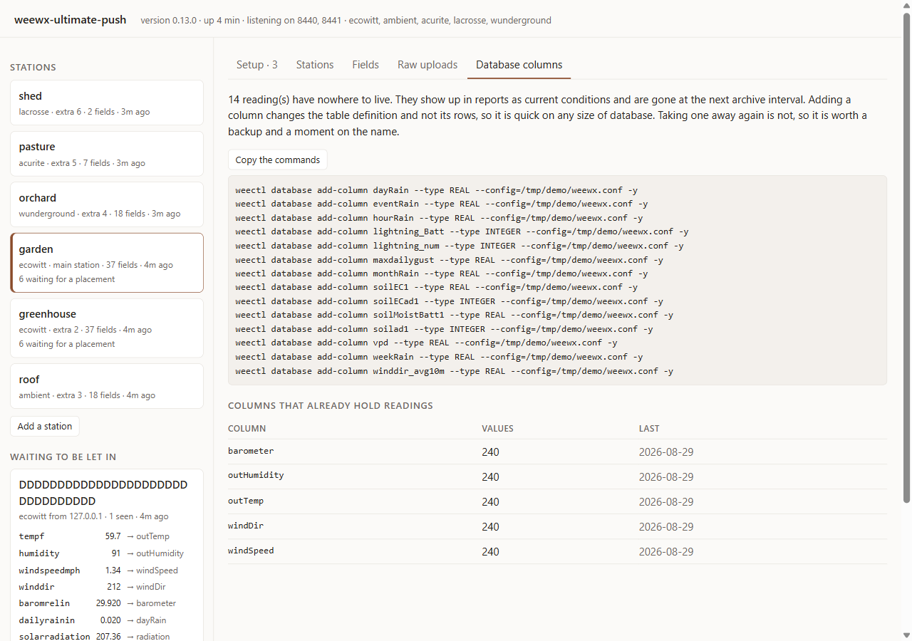

# weewx-ultimate-push

A WeeWX driver for weather hardware that pushes its readings to a server rather than
waiting to be polled. The driver listens for uploads, works out which protocol sent
each one, and converts it into WeeWX records.

Six protocols are supported on a single port.

| Protocol | Hardware | How it arrives |
|---|---|---|
| Ecowitt | GW1000/1100/1200/2000/3000, HP2551, HP2561, WS3800/3900/3910, WN1980, and the Froggit and Misol rebadges | POST, to a path of your choosing |
| Weather Underground | Fine Offset Observer, Ambient WS-1000, Sainlogic, Misol, any console set to protocol *Wunderground*, Meteobridge, most weather software | GET, `/weatherstation/updateweatherstation.php` |
| Ambient Weather | WS-2902, WS-5000, WS-1965, and the rest of the range with *Custom* upload in awnet | POST or GET, to a path of your choosing |
| WeatherFlow | Tempest, and the AIR and SKY before it | UDP broadcast on port 50222 |
| Acurite | smartHUB and Access, with a 5-in-1, towers, Pro sensors, the 899 gauge | POST, requires a DNS entry |
| LaCrosse | LW301 and LW302 gateways | POST, requires a DNS entry |

Each protocol receives the response its firmware expects: an Ecowitt gateway receives
JSON, a Weather Underground client receives `success`, an Acurite bridge receives the
reply Chaney's servers send. Hardware that does not receive the expected response
treats the upload as failed, retries, and eventually stops uploading.

## Why another driver

Field lists change as manufacturers add sensors, and drivers that are not updated drop
the readings they do not recognise.

A current HP2561AE Pro sends 45 fields. The `weewx-interceptor` driver maps 25 of them
and logs `unrecognized parameter` for the remaining 20, including the lightning sensor,
both soil probes, and the WH52.

The same happens between protocols, without a log entry. A Weather Underground station
read with an Ecowitt catalog does not fail: `tempf` and `humidity` arrive, while
`baromin`, `rainin`, `indoortempf`, `indoorhumidity` and `UV` are dropped because those
names are not in that catalog. The station records no pressure, no indoor readings and
no UV, and nothing reports it.

This driver keeps a catalog for each protocol, determines from the payload which
catalog applies, and reports what it could not place. Fields that continue a series the
catalog already describes are accepted, so a channel added to existing hardware does
not require a driver release. Fields that are merely recognisable by name are reported
and left unwritten until you decide where they belong.

The listening socket comes from `weewx.listener`, so threading, shutdown, body limits,
IPv6 and token checking are handled by the WeeWX core.

## Installation

Install the extension and restart WeeWX:

```
weectl extension install https://github.com/hilman2/weewx-ultimate-push/releases/latest/download/weewx-ultimate-push-0.13.0.zip
sudo systemctl restart weewx
```

The installer sets the station type, the driver section, and the web interface. The log
then reports the address of the web interface, including its token.

Next, point the hardware at the machine running WeeWX. For an Ecowitt console, use the
WSView Plus app: *Device List*, your console, *Weather Services*, then page through to
*Customized*. Set protocol type to *Ecowitt*, the server to the address of the machine,
and the path and port to match your configuration. The other protocols are described in
[Installation](https://github.com/hilman2/weewx-ultimate-push/wiki/Installation).

## Configuration

All settings are in one section of `weewx.conf`.

```ini
[UltimatePush]
    driver = user.ultimatepush.driver
    port = 8000
    protocols = auto
    path = /change-me/report
    infer_unknown = series

    [[field_map_extensions]]
        yearlyrainin = rain_year
```

### Driver options

#### driver

The driver module. Set to `user.ultimatepush.driver`. Required. No default.

#### protocols

Which protocols to listen for, as a comma-separated list. `auto` enables every protocol
that arrives over HTTP, which costs nothing: an upload is recognised by its content
rather than by the port it arrived on. Name protocols explicitly to add WeatherFlow,
which requires a second socket, or to settle an upload that identifies nothing. Default
is `auto`. See [Protocols](https://github.com/hilman2/weewx-ultimate-push/wiki/Protocols).

#### model

The station name used in reports. Default is `UltimatePush`.

#### infer_unknown

What happens to a field the catalog does not cover. One of `off`, `series` or `all`.
Default is `series`. See [infer_unknown](#infer_unknown-1) below.

#### field_map_extensions

A subsection mapping raw field names to WeeWX field names. Entries here take precedence
over the catalog and over the station role. Default is empty. See
[Field map](https://github.com/hilman2/weewx-ultimate-push/wiki/Field-map).

#### report_file

Where to write a report when a station sends readings the driver cannot place. Set to
an empty value to disable. Default is `/var/tmp/weewx-ultimate-push-report.txt`.

#### max_behind

How many seconds behind the computer's clock a console's own timestamp may be and still
be used. Beyond this the driver uses its own clock. Default is `3600`.

#### max_ahead

The same limit for a console whose clock runs fast. Default is `60`.

#### password

Weather Underground only. Refuse uploads that do not present this value as `PASSWORD`.
This is the only protocol here whose hardware can carry a secret. Default is none.

#### metric_wind

Weather Underground metric dialect only. Whether wind is reported in kilometres per
hour or metres per second, which cannot be determined from a payload. One of `kph` or
`mps`. Default is `kph`.

#### udp_port

WeatherFlow only. The port to listen for broadcasts on. Default is `50222`.

#### override_file

Where the settings written by the web interface are kept. Default is beside the console
list.

### Listener options

These are passed to `weewx.listener` and behave as they do for any driver that uses it.

#### port

The port to listen on. Ports below 1024 require root. Default is `80`.

#### address

The address to bind to. Use `localhost` when running behind a reverse proxy. Default is
every interface.

#### path

Accept uploads on this path only. Any other path receives a 404. Leave this unset if you
have Weather Underground hardware, whose path is fixed in firmware. Default is every
path.

#### token

Require this token, supplied as the query parameter `token`, the header `X-Auth-Token`,
or a bearer token in `Authorization`. Most hardware cannot send one. Default is none.

#### allowed_hosts

Comma-separated addresses to accept uploads from. Default is anywhere.

#### trust_proxy

Take the client address from `X-Forwarded-For`. Use only with a proxy you control.
Default is `False`.

#### max_body

The largest upload accepted, in bytes. Larger uploads receive a 413. Default is `65536`.

#### log_raw

Log every upload at debug level. Turn this on when a sensor is missing. Default is
`False`.

Every option is described in full in [Configuration](https://github.com/hilman2/weewx-ultimate-push/wiki/Configuration).

## Rain

None of this hardware reports the rain since the last upload. It reports running
counters, and `StdWXCalculate`'s `Delta` service converts one into a reading. The
installer configures it for `dayRain`, which four of the six protocols send:

```ini
[StdWXCalculate]
    [[Delta]]
        [[[rain]]]
            input = dayRain
```

WeatherFlow requires none of this, because a hub reports the millimetres since its last
report. A LaCrosse LW30x has no daily counter and requires `input = totalRain`. The
driver logs a warning at startup when this setting does not suit the protocols you have
enabled.

## infer_unknown

| Value | What happens to a field the catalog does not cover |
|---|---|
| `off` | Dropped, as other drivers do. Still logged. |
| `series` | Accepted when it continues a known series and the family's placement is not in question. Anything else is reported and left out. This is the default. |
| `all` | Accepted whenever the name indicates what it measures, for example `mph` for a wind speed. |

`series` is the default because a derived field is not a guess. Knowing where a channel
belongs is not the same as knowing the field is free, however. A new WN34 channel would
be placed in `extraTemp`, where a sensor configured two years ago may already have
history, and two series in one column cannot be separated afterwards. A channel from a
family whose placement is a convention therefore waits for you, and the log gives the
line to add:

```
INFO user.ultimatepush.mapping: New channel 'temp9f' would go to 'extraTemp9'.
    Which sensor that is, and whether that field is free, only you know. Add
    'temp9f = extraTemp9' under [[field_map_extensions]] to accept it.
```

Families with nowhere else to be placed, such as a laser rangefinder's depth or a
lightning count, are accepted without asking. `all` accepts everything sooner, at the
risk of a unit that has not been checked.

Whatever the setting, the log reports what arrived:

```
INFO user.ultimatepush.mapping: New field 'leafwetness_ch5' -> 'leafWet5'
    (group_percent), continues leafwetness_ch, e.g. leafWet1
```

A field only reaches the database if the archive table has a column for it. Fields
outside the standard schema require one to be added, which is a button in the web
interface or `weectl database add-column` from a terminal. See
[Database columns](https://github.com/hilman2/weewx-ultimate-push/wiki/Database-columns).

## The web interface



The web interface runs on a port of its own and is enabled by the installer, with a
token generated at install time that differs on every machine. The driver logs the
address at startup:

```
INFO user.ultimatepush.driver: The web interface is at
http://192.168.1.50:8080/?token=kJ7mQx2vRt9w
```

The interface opens on a checklist of whatever still stands between the current state
and a station that records properly. If nothing has uploaded yet, enter a name and
select the hardware: for hardware whose upload path is yours to choose, the driver
generates a path and displays the settings to enter into the console's app. The page
detects the first upload without being reloaded.

### Setting up a station

Enter a name, select the hardware, and the driver generates an upload path for that
station and displays exactly what to type into the console's app. The page detects the
first upload without being reloaded.



The role is part of the same form. The first station is the main station; every station
after it is offered as an extra sensor on a free channel, which is what a second console
beside an existing one usually is.

### Stations

Every station the driver knows, including those set up but never heard from, and those
declared in `weewx.conf`. Each entry carries the console settings for that station and
the archive columns it fills, and its name, role and channel can be changed there.



### Fields

What every station sends, and where each reading is written. Placing a field takes
effect on the next upload, with no restart and no editing of files.



Each row states what its column costs: `column ready`, `no column` with a button that
creates it, `column holds 240 earlier values`, or the station that already fills it. The
selector offers the fields that measure the same thing first, then everything else, then
`nowhere`, then a field of your own.

The interface exists because placing a field is irreversible if it is done wrongly, and
because whether a column already holds another sensor's readings is not something a log
entry can report.

### Before anything irreversible

Two changes reach the archive rather than only the settings file: taking the main
station away from another station, and writing into a column that already holds
readings. Both are stated in full, with the row counts and dates out of the archive
table, and both are confirmed twice.



### Database columns

Which readings have nowhere to be written, with the `weectl` commands for exactly the
columns this station needs, and what the archive table already holds.



An address that presents the wrong token ten times in five minutes stops receiving
answers. The interface is plain HTTP; on a private network this is the usual trade, and
across the internet it should be placed behind TLS. Setting `enable = false` closes the
port. See [Web interface](https://github.com/hilman2/weewx-ultimate-push/wiki/Web-interface).

## Several stations

One station requires none of this. Every reading is written where it belongs.

A second station raises a question that cannot be avoided: both send `outTemp`, and
there is one `outTemp` column. Left alone, the two would write it in turn every few
seconds, producing a column that holds a mixture nothing can separate afterwards.

The driver applies three rules.

**Exactly one station is the main station.** Its readings are written where they
belong. Every station set up after it becomes an extra sensor, whose temperature and
humidity are written to `extraTempN` and `extraHumidN`. Making a second station the
main station moves the first aside, and the interface requires confirmation before
doing so.

**A column belongs to whichever station fills it first.** Any other station's reading
for that column is dropped rather than written over it. The main station takes
precedence, so which console owns `outTemp` does not depend on which one uploaded first
after a restart. Ownership is recorded in the settings file, so it survives a restart.

**A column that already holds readings is not written into without confirmation.** When
a station is set up, the driver reads the archive table and reports which columns
already hold data, how many rows, and the date of the most recent one. Continuing a
series is correct when it is the same weather station in the same place, and mixes two
sensors when it is not. Only you can tell which. See [Stations](https://github.com/hilman2/weewx-ultimate-push/wiki/Stations).

## Documentation

Everything below is in the [wiki](https://github.com/hilman2/weewx-ultimate-push/wiki).

| | |
|---|---|
| [Installation](https://github.com/hilman2/weewx-ultimate-push/wiki/Installation) | install, point the hardware at it, start |
| [Protocols](https://github.com/hilman2/weewx-ultimate-push/wiki/Protocols) | what each protocol sends, and how they are told apart |
| [Web interface](https://github.com/hilman2/weewx-ultimate-push/wiki/Web-interface) | see what a station sends, and place a field without a restart |
| [Configuration](https://github.com/hilman2/weewx-ultimate-push/wiki/Configuration) | every option, with worked examples |
| [Field map](https://github.com/hilman2/weewx-ultimate-push/wiki/Field-map) | how a reading reaches a column |
| [Hardware](https://github.com/hilman2/weewx-ultimate-push/wiki/Hardware) | every device, and what it takes to reach it |
| [Sensors](https://github.com/hilman2/weewx-ultimate-push/wiki/Sensors) | every field this driver knows, by sensor |
| [Unknown fields](https://github.com/hilman2/weewx-ultimate-push/wiki/Unknown-fields) | what happens to a field the catalog misses |
| [Stations](https://github.com/hilman2/weewx-ultimate-push/wiki/Stations) | setting one up, roles, and column ownership |
| [Database columns](https://github.com/hilman2/weewx-ultimate-push/wiki/Database-columns) | which columns a station needs |
| [Diagnostics](https://github.com/hilman2/weewx-ultimate-push/wiki/Diagnostics) | one command that answers most questions |
| [Reporting a new sensor](https://github.com/hilman2/weewx-ultimate-push/wiki/New-sensors) | exactly what to send |
| [Troubleshooting](https://github.com/hilman2/weewx-ultimate-push/wiki/Troubleshooting) | symptoms and what they mean |
| [Keeping strangers out](https://github.com/hilman2/weewx-ultimate-push/wiki/Security) | path, token, addresses, TLS |
| [Development](https://github.com/hilman2/weewx-ultimate-push/wiki/Development) | layout, tests, rebuilding a catalog |

## Where the field names come from

Two catalogs are generated, because their hardware keeps gaining sensors and a
generated catalog makes each addition a reviewable diff:

- `tools/import_catalog.py` reads the Ecowitt names from the `ecowittcustom` driver by
  [Werner Krenn](https://github.com/WernerKr/Ecowitt-or-DAVIS-stations-and-Season-skin).
- `tools/import_ambient.py` reads the Ambient names from the `ambient_station`
  integration in Home Assistant, which is maintained against real hardware.

The remaining catalogs are written out, because their protocols are complete. The
Weather Underground specification was published once and then withdrawn; the copy this
catalog was derived from is in `tests/fixtures/wunderground/spec.txt`, where a test
checks the catalog against it. The WeatherFlow UDP reference is current and public. The
Acurite and LaCrosse names come from frames captured from real hardware.

What a field measures is determined by the hardware. Where it is written is decided in
the tools and the catalogs, in three lists:

- `CHANNELS`, how far each sensor family reaches, from the manufacturer's compatibility
  table.
- `REMAP`, families placed differently from upstream, with the reason beside each. The
  WN34 and the WH52 are here.
- `OVERRIDES`, single fields, likewise with the reason.

The generators report what they could not settle: fields written by more than one
reading, readings that upstream sends to more than one field, and raw names with no
target at all.

## Tests

```
pip install pytest
python -m pytest tests -q
```

The transport, the catalogs, the protocols and the inference require nothing but
Python. The tests run from captured payloads, so a change that would have dropped a
field fails a test rather than appearing in a database a month later. Captured payloads
are in `tests/fixtures`, with anything that named the station removed.

## Credits and licence

GPLv3.

- The Ecowitt catalog comes from `ecowittcustom` by Werner Krenn.
- That driver descends from `weewx-interceptor` by Matthew Wall, which is the origin of
  the approach of listening for the upload, and of the Acurite, LaCrosse and Fine
  Offset names and captured frames.
- The Ambient names come from the `ambient_station` integration in Home Assistant,
  which is Apache-2.0.
- WeeWX is by Tom Keffer and Matthew Wall.
